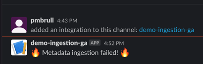

# OpenMetadata Ingestion with GitHub Actions

The goal of this demo is to showcase how you can run & schedule the ingestion process using GitHub Actions.

For this example, we'll ingest Snowflake data into our OpenMetadata Sandbox (https://sandbox.open-metadata.org)
by triggering a GitHub action on this same repo!

To follow the demo along, you'll need to change the configurations to point to your own OpenMetadata instance,
since we won't be sharing any of the secrets 🤫

## Understanding the Ingestion Framework Architecture

## 1. Preparing the YAML

Then, our first step is to prepare the YAML configuration that represents the Workflow that we will use to run
the Snowflake metadata ingestion. Note that the process to prepare the Profiler Workflow, Data Quality, Data Insights,...
or any other process will be completely analogous. You can find further information in the [docs](https://docs.open-metadata.org/v1.0.0/connectors/database/snowflake/airflow).

```yaml
source:
  type: snowflake
  serviceName: snowflake_from_github_actions
  serviceConnection:
    config:
      type: Snowflake
      username: <user>
      password: <password>
      warehouse: <warehouse>
      account: <account>
  sourceConfig:
    config:
      type: DatabaseMetadata
      includeViews: true
      databaseFilterPattern:
        includes:
        - SNOWFLAKE_SAMPLE_DATA
      schemaFilterPattern:
        excludes:
        - INFORMATION_SCHEMA
        includes:
        - TPCH_SF1000$
        - PUBLIC
sink:
  type: metadata-rest
  config: {}
workflowConfig:
  openMetadataServerConfig:
    hostPort: https://sandbox.open-metadata.org
    authProvider: openmetadata
    securityConfig:
      jwtToken: <JWT>
```

Any sensitive information will be stored under the repository secrets and passed at runtime as environment variables.

## 2. Prepare the Python script

In the GitHub Action we will just be triggering a custom Python script. This script will:
- Load the secrets from environment variables (we don't want any security risks!),
- Prepare the `Workflow` class from the Ingestion Framework that contains all the logic on how to run the metadata ingestion,
- Execute the workflow and log the results.

A simplified version of such script can looks like follows:

```python
import os
import yaml

from metadata.ingestion.api.workflow import Workflow

CONFIG = f"""
source:
  type: snowflake
  serviceName: snowflake_from_github_actions
  serviceConnection:
    config:
      type: Snowflake
      username: {os.getenv('SNOWFLAKE_USERNAME')}
...
"""


def run():
    workflow_config = yaml.safe_load(CONFIG)
    workflow = Workflow.create(workflow_config)
    workflow.execute()
    workflow.raise_from_status()
    workflow.print_status()
    workflow.stop()


if __name__ == "__main__":
    run()
```

## 3. Create the GitHub Action

Now that we have all the ingredients, we just need to build a simple GitHub Actions with the following steps:
- Install Python
- Prepare virtual environment with the `openmetadata-ingestion` package
- Run the script!

It is as simple as this. Internally the function `run` we created will be sending the results to the OpenMetadata
server, so there's nothing else we need to do here.

A first version of the action could be:

```yaml
name: ingest-snowflake
on:
  # Any expression you'd like here
  schedule:
    - cron:  '0 */2 * * *'
  # If you also want to execute it manually
  workflow_dispatch:

permissions:
  id-token: write
  contents: read

jobs:
  ingest:
    runs-on: ubuntu-latest

    steps:
    # Pick up the repository code, where the script lives
    - name: Checkout
      uses: actions/checkout@v3

    # Prepare Python in the GitHub Agent
    - name: Set up Python 3.9
      uses: actions/setup-python@v4
      with:
        python-version: 3.9

    # Install the dependencies. Make sure that the client version matches the server!
    - name: Install Deps
      run: |
        python -m venv env
        source env/bin/activate
        pip install "openmetadata-ingestion[snowflake]~=1.0.2"

    - name: Run Ingestion
      run: |
        source env/bin/activate
        python ingestion-github-actions/snowflake_ingestion.py
      # Add the env vars we need to load the snowflake credentials
      env:
         SNOWFLAKE_USERNAME: ${{ secrets.SNOWFLAKE_USERNAME }}
         SNOWFLAKE_PASSWORD: ${{ secrets.SNOWFLAKE_PASSWORD }}
         SNOWFLAKE_WAREHOUSE: ${{ secrets.SNOWFLAKE_WAREHOUSE }}
         SNOWFLAKE_ACCOUNT: ${{ secrets.SNOWFLAKE_ACCOUNT }}
         SBX_JWT: ${{ secrets.SBX_JWT }}
```

## 4. Getting Alerts in Slack

A very interesting option that GitHub Actions provide is the ability to get alerts in Slack after our action fails.

This can become specially useful if we want to be notified when our metadata ingestion is not working as expected. We
can use the same setup as above with a couple of slight changes:

```yaml
    - name: Run Ingestion
      id: ingestion
      continue-on-error: true
      run: |
        source env/bin/activate
        python ingestion-github-actions/snowflake_ingestion.py
      # Add the env vars we need to load the snowflake credentials
      env:
         SNOWFLAKE_USERNAME: ${{ secrets.SNOWFLAKE_USERNAME }}
         SNOWFLAKE_PASSWORD: ${{ secrets.SNOWFLAKE_PASSWORD }}
         SNOWFLAKE_WAREHOUSE: ${{ secrets.SNOWFLAKE_WAREHOUSE }}
         SNOWFLAKE_ACCOUNT: ${{ secrets.SNOWFLAKE_ACCOUNT }}
         SBX_JWT: ${{ secrets.SBX_JWT }}

    - name: Slack on Failure
      if: steps.ingestion.outcome != 'success'
      uses: slackapi/slack-github-action@v1.23.0
      with:
        payload: |
          {
            "text": "🔥 Metadata ingestion failed! 🔥"
          }
      env:
        SLACK_WEBHOOK_URL: ${{ secrets.SLACK_WEBHOOK }}
        SLACK_WEBHOOK_TYPE: INCOMING_WEBHOOK

    - name: Force failure
      if: steps.ingestion.outcome != 'success'
      run: |
        exit 1
```

We have:
1. marked the `Run Ingestion` step with a specific `id` and with `continue-on-error: true`. If anything happens, we don't
   want the action to stop.
2. We added a step with `slackapi/slack-github-action@v1.23.0`. By passing a Slack Webhook link via a secret, we can
   send any payload to a specific Slack channel. You can find more info on how to setup a Slack Webhook [here](https://api.slack.com/messaging/webhooks).
3. If our `ingestion` step fails, we still want to mark the action as failed, so we are forcing the failure we
   skipped before.


