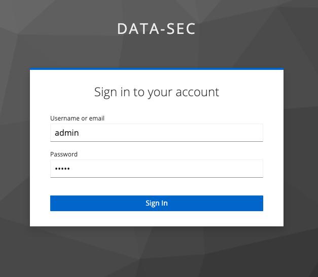
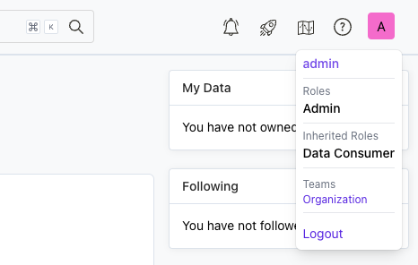
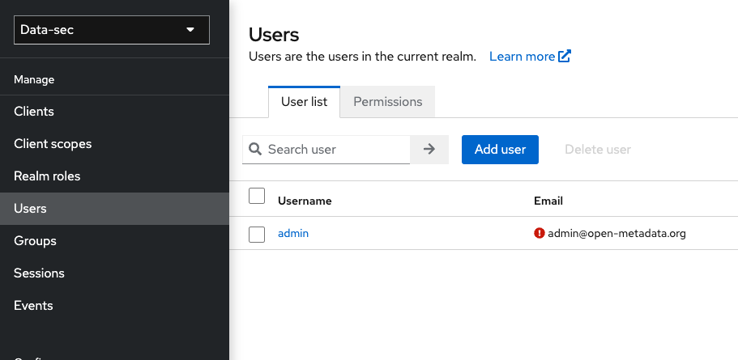
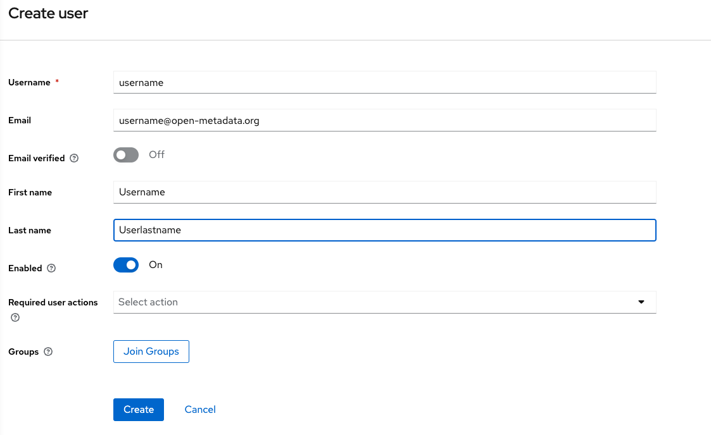
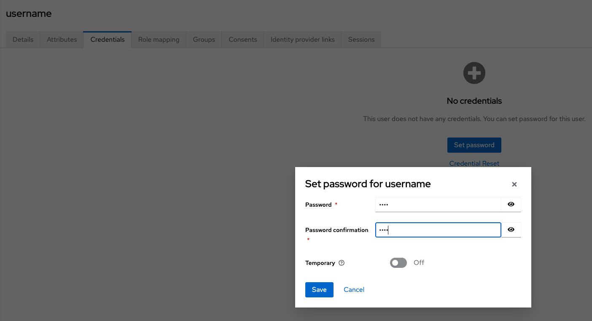

# Keycloak SSO Demo

## Initialize demo

In this directory you will find a Docker Compose file that will spin up Keycloak and OM server

```shell
docker compose --env-file .env-keycloak up
```

## Login into OpenMetadata

After clicking on `Sign in with Keycloak` you will be able to sign in using the username `admin` and the password `admin`. 



If everything works fine, the username must appear in the top right corner of OpenMetadata UI.



## Add new users in Keycloak SSO

In this [url](http://localhost:8081/admin/master/console/#/data-sec/users) you can add new users to your Keycloak SSO.



Click on `Add user` and fill the user details. Use `open-metadata.org` as the email domain for the new users.



Set a password for the new user in the `Credentials` tab.



## Note

The docker-compose file used in this demo is fixed to the `0.12.0` version, but you can achieve the same result to any version by getting the specific
docker-compose file in this [link](https://github.com/open-metadata/OpenMetadata/blob/main/docker/metadata/docker-compose.yml) (there are different branches 
with the specific version). 

Once you downloaded the docker-compose file, you have to add the `keycloak` service to the docker-compose file.

```yaml
  keycloak:
    image: quay.io/keycloak/keycloak:19.0.1
    command:
      - start-dev
      - --import-realm
    environment:
      KEYCLOAK_IMPORT: /tmp/realm-export.json -Dkeycloak.profile.feature.upload_scripts=enabled
      KEYCLOAK_ADMIN: admin
      KEYCLOAK_ADMIN_PASSWORD: admin
    ports:
      - "8081:8080"
    volumes:
      - ./config/data-sec.json:/opt/keycloak/data/import/data-sec.json
```

