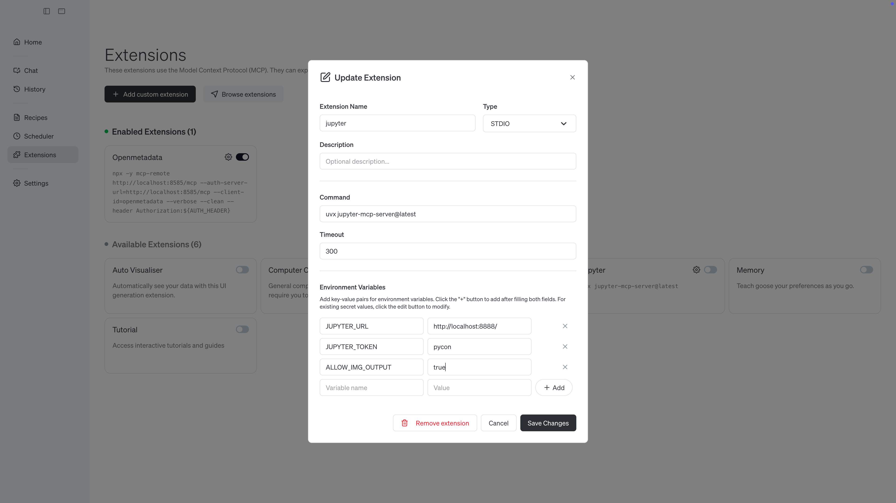
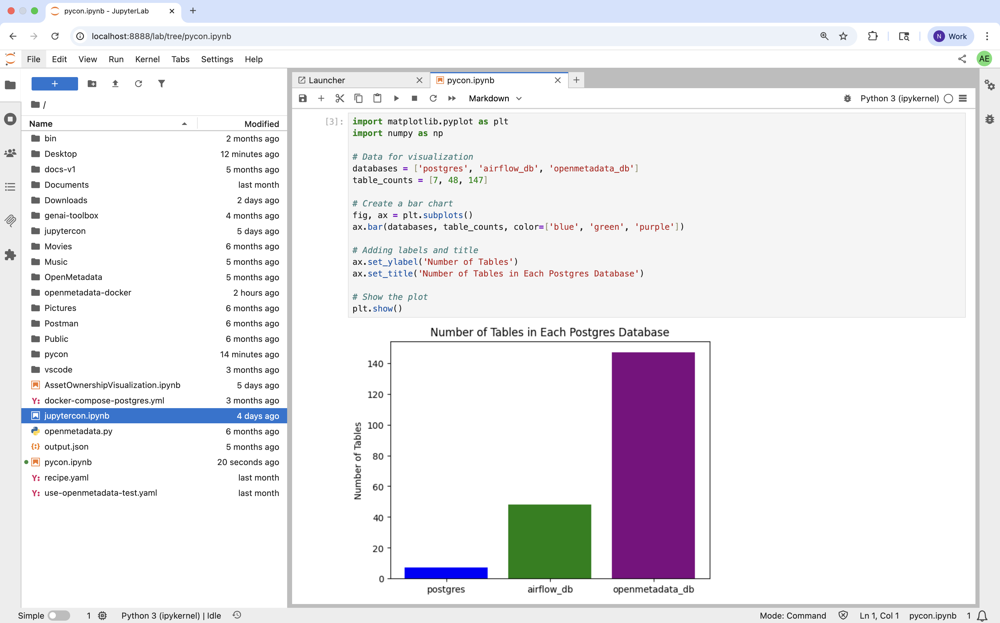
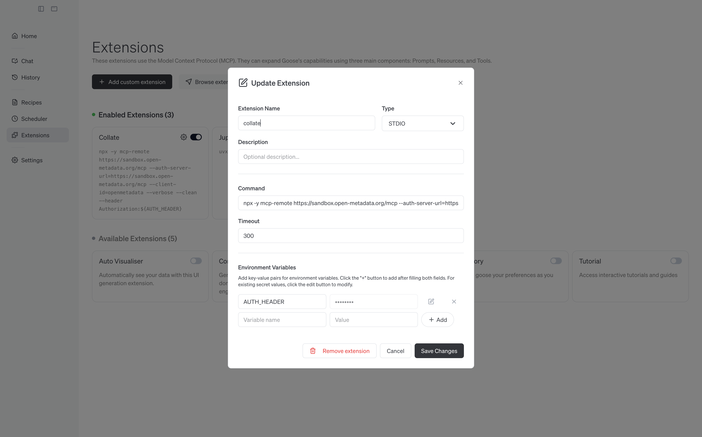

# AI Driven Automation in Open-Source Metadata Platforms: Embedding an MCP Server

Hello PyCon Ireland! Thank you for joining our training session! You can find the contents below, please let me know if there's anything you need!

*Note - This training was prepared using a MacBook*

## Contents
1. [Prerequisites](#prerequisites)
2. [OpenMetadata](#openmetadata)
3. [goose](#goose) 
4. [Integrating Python](#python)
5. [Scaling out with Collate](#collate)
6. [Wrapping up and feedback](#end)

## Prerequisites <a name="prerequisites"></a>
Before getting started, please make sure you have the following three services on your laptop:
1. [node](https://nodejs.org/en/download) - on a MacBook, you might have to run `xcode-select --install` before installing Node
2. [Docker Desktop 4.49.0](https://www.docker.com/products/docker-desktop/) - there are open-source alternatives to Docker, like Podman, that are great, please do not use them for this workshop!
3. [goose Desktop 1.12.0](https://block.github.io/goose/docs/quickstart/) - Desktop, not goose CLI

This workshop is *bring-you-own-agent*, and you will need API key for it, almost any AI Agent will do!

## OpenMetadata <a name="openmetadata"></a>
### Installing OpenMetadata
With the prerequisites installed, we will move on to installing OpenMetadata. OpenMetadata is an open-source metadata platform for data discovery, observability and governance! If you have any questions about OpenMetadata, please ask! We will be installing OpenMetadata along with its supporting components:

 * Airflow - Which orchestrates ingestion jobs that bring new metadata into OpenMetadata and keeps it up-to-date as data systems change
 * Elasticsearch - Search indexing to retrieve OpenMetadata assets
 * PostgreSQL - Stores and maintain state for OpenMetadata assets

We'll bring all these services online with the following commands:

```
curl -sL -o docker-compose-postgres.yml https://github.com/open-metadata/OpenMetadata/releases/download/1.10.4-release/docker-compose-postgres.yml
docker compose -f docker-compose-postgres.yml up --detach
```

Once OpenMetadata is ready, run 

```
curl -fsSL https://raw.githubusercontent.com/open-metadata/openmetadata-demo/main/postgres/docker/postgres-script.sql | docker exec -i openmetadata_postgresql psql -U postgres -d postgres
```

|  |
|:--:|
| Welcome to OpenMetadata! |

### Adding postgreSQL to OpenMetadata
Adding a connector in OpenMetadata is easy, we've already loaded some sample data into the postgreSQL database OpenMetadata is using to manage asset states, so we will use that, but you can just as easily connect to cloud data services like Snowflake, RedShift, BigQuery, and Databricks.

* Go to [OpenMetadata](http://localhost:8585/)
* Login
  * Email: admin@open-metadata.org
  * Password: admin
* Go to Settings -> Services -> Databases -> and select **Add New Service**
* Select **Postgres**, then **Next**
* Enter the **Service Name** as *postgres* with the following Connection Details:
  * Username: `openmetadata_user`
  * Auth Configuration Type: `Basic Auth`
  * Password: `openmetadata_password`
  * Host and Port: `postgresql:5432`
  * Database: openmetadata_db
  * Enable **Ingest All Databases**
  * Select **Next**
  * No edits are needed in the filters page, scroll down and select **Save**
 
|  |
|:--:|
| Adding a postgres connector to OpenMetadata |

## Adding the OpenMetadata MCP Server to goose <a name="setup"></a>
An OpenMetadata Personal Access Token (PAT) will be needed to add OpenMetadata to goose. From [here](http://localhost:8585/users/admin/access-token), select **Generate New Token**

|  |
|:--:|
| An OpenMetadata PAT is needed to use it in goose |

Copy this token to paste into goose later.

With OpenMetadata up and running, we can add it's MCP server as a goose extension! Open goose, select Extensions, then **+Add custom extension**

Please create your OpenMetadata Extension with the following options:
* Extension Name: `openmetadata`
* Type: `STDIO`
* Description:
* Command: `npx -y mcp-remote http://localhost:8585/mcp --auth-server-url=http://localhost:8585/mcp --client-id=openmetadata --verbose --clean --header Authorization:${AUTH_HEADER}`
* Timeout: `300`
* Environment Variables
 * Variable name: `AUTH_HEADER`
 * Value:
   ```
   Bearer <PASTE_YOUR_OpenMetadata_TOKEN_HERE>
   ```
 * Select **+Add**
* Select **Save Changes**

|  |
|:--:|
| OpenMetadata MCP Server in goose |

## goose 🎉 <a name="goose"></a>
Now we'll recreate one of the usecases we just saw from the community!

In our [sample data schema](http://localhost:8585/databaseSchema/postgres.postgres.public), you will see 7 tables. We will add some classifications to this schema and have an AI agent push those changes to every table.

* In OpenMetadata
  * Go to the [public databaseSchema](http://localhost:8585/databaseSchema/postgres.postgres.public)
  * Select the **Edit Certification** button
  * Select **Gold**
  * Select :white_check_mark: to apply this certification to the *schema*
* In goose
  * Go to the [Use OpenMetadata goose Recipe](https://block.github.io/goose/recipes/detail?id=use-openmetadata)
  * Scroll down to *Launch in Goose Desktop*, and paste your fqn `postgres.postgres.public` into the new goose session!  
* Back in OpenMetadata
   * [Tables](http://localhost:8585/table/postgres.postgres.public.actor) should now have the same Certification!      

Feel free to experiment with OpenMetadata, OpenMetadata MCP, and goose!

## Integrating Python via Jupyter MCP <a name="python"></a>
For this lab, we are going to create a virtual environment so that everyone can work from the same Python.

```
python3 -m venv pycon
source pycon/bin/activate
```

From the pycon virtual environment, run:

```
pip install jupyterlab==4.4.1 jupyter-collaboration==4.0.2 jupyter-mcp-tools==0.1.3 ipykernel uv
pip uninstall -y pycrdt datalayer_pycrdt
pip install datalayer_pycrdt==0.12.17
jupyter lab --port 8888 --IdentityProvider.token pycon --ip 0.0.0.0
```
This will start a JupyterLab instance at [http://localhost:8888/](http://localhost:8888/), if you are prompt for a password, enter `pycon`.

### Adding JupyterLab to goose
Just like OpenMetadata, we will add JupyterLab as an extension to goose with the following options:

* Extension Name: `jupyter`
* Type: `STDIO`
* Description:
* Command: `uvx jupyter-mcp-server@latest`
* Timeout: `300`
* Environment Variables
  * Variable name: `JUPYTER_URL`
   * Value: `"http://localhost:8888"`
  * Variable name: `JUPYTER_TOKEN`
    * Value: `pycon`
  * Variable name: `ALLOW_IMG_OUTPUT`
    * Value: `true`
  * Make sure to Select **+Add** for each Environment Variable
* Select **Save Changes**

|  |
|:--:|
| Extension details for Jupyter MCP Server |

We can now use the JupyterLab and OpenMetadata MCP Servers together in goose!

In goose, prompt

```
How many tables are in postgres.postgres.public?
```

then,

```
How many tables are in postgres.postgres.public, postgres.airflow_db.public, and postgres.openmetadata_db.public
```

goose should return 7, 48, and 147, then we can bring JupyterLab in,

```
Create a new notebook pycon.ipynb and build a visualization with the table counts for each postgres database
```

|  |
|:--:|
| Combining MCP Servers from OpenMetadata and Jupyter! |

## Scaling out with Collate <a name="collate"></a>
The [OpenMetadata Sandbox](https://sandbox.open-metadata.org/) is an OpenMetadata instance hosted and curated by Collate. We can use it for a better look at combining OpenMetadata and Jupyter MCP servers. Log into the sandbox, and generate a Personal Access Token for yourself, just like before, and add one more extension to goose.

* Extension Name: `collate`
* Type: `STDIO`
* Description:
* Command: `uvx jupyter-mcp-server@latest`
* Timeout: `300`
* Environment Variables
 * Variable name: `AUTH_HEADER`
 * Value:
   ```
   Bearer <PASTE_YOUR_OpenMetadata_TOKEN_HERE>
   ```
* Select **+Add**, then **Save Changes**

|  |
|:--:|
| Adding the OpenMetadata Sandbox to goose |

For a model to be able to easily differentiate between this OpenMetadata and the one on your laptop, we have named it Collate. Now you can try the following prompts:

```
How many assets are in collate?
```

or:

```
How many assets have gold certifications, silver certifications, and bronze certifications?
```

and to combine it with the Jupyter MCP server:
```
Create a new notebook collate.ipynb and build a visualization with the asset counts by type in one cell and the assets counts by certification in another.
```

## Wrapping up and feedback <a name="end"></a>
To shutdown your OpenMetadata services, run the following command:

```
docker compose down
```

Or, you can add additional metadata connectors to your OpenMetadata instance! Popular connectors include Snowflake, BigQuery, Databricks, and Tableau!
