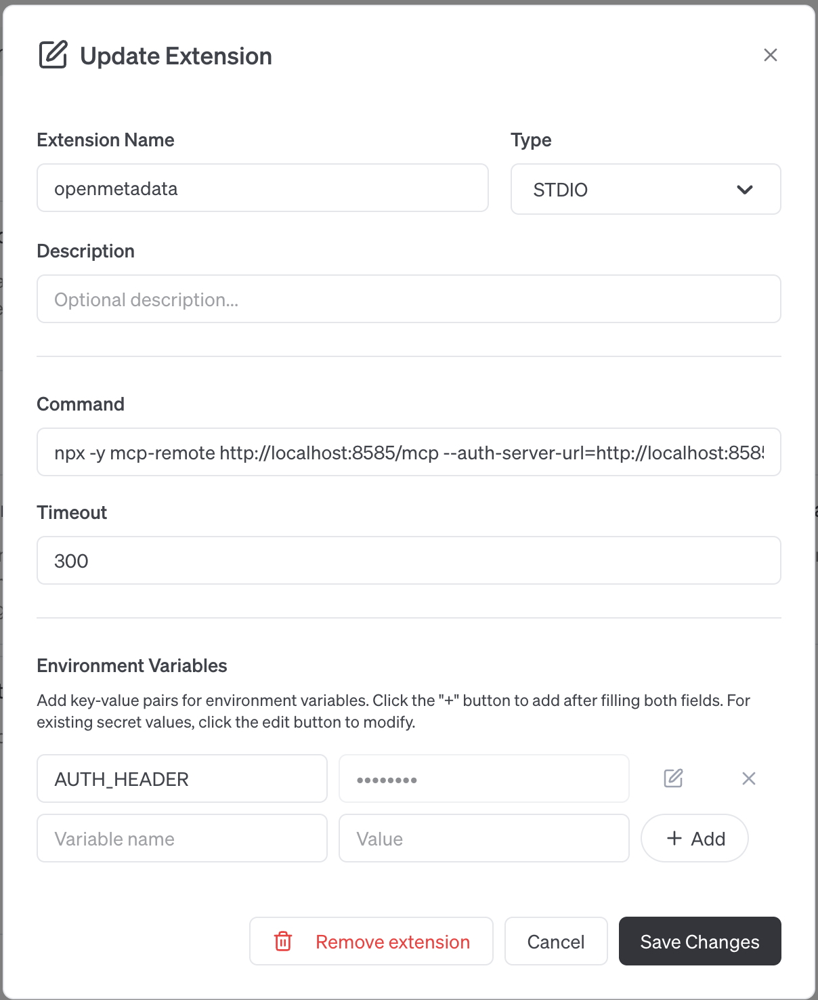

# AI Driven Automation in Open-Source Metadata Platforms: Embedding an MCP Server

Hello Open Data Science Conference! Thank you for joining our training session! You can find the contents below, please let me know if there's anything you need!

*Note - This training was prepared using a MacBook*

## Contents
1. [Prerequisites](#prerequisites)
2. [OpenMetadata](#openmetadata)
3. [Prompt party!](#party) 🎉
4. [goose Recipes](#goose)
5. [Wrapping up and feedback](#end)

## Prerequisites <a name="prerequisites"></a>
Before getting started, please make sure you have the following three services on your laptop:
1. [node](https://nodejs.org/en/download) - on a MacBook, you might have to run `xcode-select --install` before installing Node
2. [Docker Desktop 4.49.0](https://www.docker.com/products/docker-desktop/) - there are open-source alternatives to Docker, like Podman, that are great, please do not use them for this workshop!
3. [goose Desktop 1.12.0](https://block.github.io/goose/docs/quickstart/) - Desktop, not goose CLI

This workshop is *bring-you-own-agent*, and you will need API key for it, almost any AI Agent will do!

## OpenMetadata <a name="openmetadata"></a>
### Installing OpenMetadata
With the prerequisites installed, we will move on to installing OpenMetadata. OpenMetadata is an open-source metadata platform for data discovery, observability and governance! If you have any questions about OpenMetadata, please ask! We will be installing OpenMetadata along with its supporting components:

 * Airflow - Which orchestrates ingestion jobs that bring new metadata into OpenMetadata and keeps it up-to-date as data systems change
 * Elasticsearch - Search indexing to retrieve OpenMetadata assets
 * PostgreSQL - Stores and maintain state for OpenMetadata assets

We'll bring all these services online with the following commands:

```
curl -sL -o docker-compose-postgres.yml https://github.com/open-metadata/OpenMetadata/releases/download/1.10.3-release/docker-compose-postgres.yml
docker compose -f docker-compose-postgres.yml up --detach
```

Once OpenMetadata is ready, run 

```
curl -fsSL https://raw.githubusercontent.com/open-metadata/openmetadata-demo/main/postgres/docker/postgres-script.sql | docker exec -i openmetadata_postgresql psql -U postgres -d postgres
```

|  |
|:--:|
| Welcome to OpenMetadata! |

### Adding postgreSQL to OpenMetadata
Adding a connector in OpenMetadata is easy, we've already loaded some sample data into the postgreSQL database OpenMetadata is using to manage asset states, so we will use that, but you can just as easily connect to cloud data services like Snowflake, RedShift, BigQuery, and Databricks.

* Go to [OpenMetadata](http://localhost:8585/)
* Login
  * Email: admin@open-metadata.org
  * Password: admin
* Go to Settings -> Services -> Databases -> and select **Add New Service**
* Select **Postgres**, then **Next**
* Enter the **Service Name** as *postgres* with the following Connection Details:
  * Username: `openmetadata_user`
  * Auth Configuration Type: `Basic Auth`
  * Password: `openmetadata_password`
  * Host and Port: `postgresql:5432`
  * Database: openmetadata_db
  * Enable **Ingest All Databases**
  * Select **Next**
  * No edits are needed in the filters page, scroll down and select **Save**
 
|  |
|:--:|
| Adding a postgres connector to OpenMetadata |

## Adding the OpenMetadata MCP Server to goose <a name="setup"></a>
An OpenMetadata Personal Access Token (PAT) will be needed to add OpenMetadata to goose. From [here](http://localhost:8585/users/admin/access-token), select **Generate New Token**

|  |
|:--:|
| An OpenMetadata PAT is needed to use it in goose |

Copy this token for to paste into goose later.

With OpenMetadata up and running, we can add it's MCP server as a goose extension! Open goose, select Extensions, then **+Add custom extension**

Please create your OpenMetadata Extension with the following options:
* Extension Name: `openmetadata`
* Type: `STDIO`
* Description:
* Command: `npx -y mcp-remote http://localhost:8585/mcp --auth-server-url=http://localhost:8585/mcp --client-id=openmetadata --verbose --clean --header Authorization:${AUTH_HEADER}`
* Timeout: `300`
* Environment Variables
 * Variable name: `AUTH_HEADER`
 * Value:
   ```
   Bearer <PASTE_YOUR_OpenMetadata_TOKEN_HERE>
   ```
 * Select **+Add**
* Select **Save Changes**

|  |
|:--:|
| OpenMetadata MCP Server in goose |

## Prompt party! 🎉 <a name="party"></a>
Now we'll recreate one of the usecases we just saw from the community!

In our [sample data schema](http://localhost:8585/databaseSchema/postgres.postgres.public), you will see 7 tables. We will add some classifications to this schema and have an AI agent push those changes to every table.

* In OpenMetadata
  * Go to the [public databaseSchema](http://localhost:8585/databaseSchema/postgres.postgres.public)
  * Select the **Edit Certification** button
  * Select **Gold**
  * Select :white_check_mark: to apply this certification to the *schema*
* In goose
  * Select model
  * Use the following prompt
    ```
    Take classifications from postgres.postgres.public and apply them to all the tables that are listed in postgres.postgres.public

    Here's what to do step by step:

    1. **Verify postgres.postgres.public exists in openmetadata**
    2. **Ask user if they will be propagating the postgres.postgres.public owner/certification or a particular tag**
    3. **Get details of postgres.postgres.public in openmetadata**
      - the owner/certification/tag to be applied to other assets
    4. **List tables of postgres.postgres.public**
    5. **Patch all tables that are returned**
    ```
  * Back in OpenMetadata
    * [Tables](http://localhost:8585/table/postgres.postgres.public.actor) should now have the same Certification!   
## goose Recipes <a name="goose"></a>
We can make this even easier via goose Recipes. Recipes are files that contain all the details to allow goose to do one specific task.

* In OpenMetadata
  * Go back to the same [public databaseSchema](http://localhost:8585/databaseSchema/postgres.postgres.public)
  * Change the tier and/or add *admin* as the asset owner, copy the fully qualified name (fqn) or this schema `postgres.postgres.public`
* Go to the [Use OpenMetadata goose Recipe](https://block.github.io/goose/recipes/detail?id=use-openmetadata)
* Scroll down to *Launch in Goose Desktop*, and paste your fqn into the new goose session!

Feel free to experiment with OpenMetadata, OpenMetadata MCP, and goose!

## Wrapping up and feedback <a name="end"></a>
To shutdown your OpenMetadata services, run the following command:

```
docker compose down
```

Or, you can add additional metadata connectors to your OpenMetadata instance! Popular connectors include Snowflake, BigQuery, Databricks, and Tableau!

## Troubleshooting
Elasticsearch issues?
Run `docker ps` if `openmetadata_elasticsearch` is not running, you may not have enough memory allocated to Docker Desktop

Can't build your own OpenMetadata? Create an account in our Sandbox, [generate a personal access token](https://docs.open-metadata.org/latest/how-to-guides/mcp#adding-a-personal-access-token-to-your-mcp-client), and connect to [goose](#setup) using https://sandbox.open-metadata.org/ instead of http://localhost:8585/

Model running into rate-limiting issue? Instruct the model to batch patch requests in order to reduce chances of rate-limiting.
