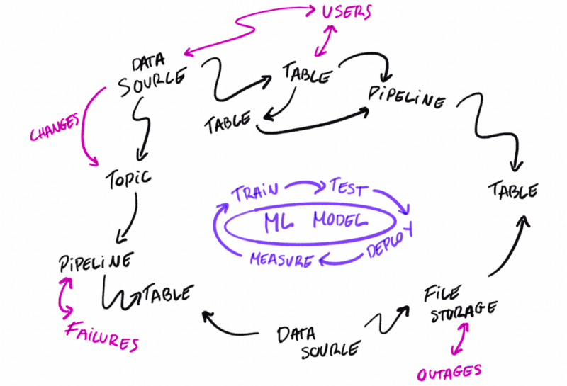

# ML Model CICD

The goal of this demo is learning how to leverage the OpenMetadata API to create a CICD process
that will publish the changes on our ML Models once they go to PROD.

**OBS**: Note that this demo is based on OpenMetadata version 0.13.0. If playing locally with the `openmetadata-ingestion`
package, make sure to install `openmetadata-ingestion==0.13.0`

## Requirements

### Docker Compose

Docker compose v2 installed on your laptop. You can install it following the official [docs](https://docs.docker.com/compose/install/).

```bash
❯ docker compose version
Docker Compose version v2.2.3
```

### Python 3

OpenMetadata supports Python 3.7+. This demo has been built and tested using Python 3.9:

```bash
❯ python -V
Python 3.9.13
```

It is recommended to use python within a virtual environment for isolation:

```bash
python -m venv venv
source venv/bin/activate
```

You can now validate that you are using the right python executable with:

```bash
❯ which python
~/openmetadata-demo/postgres/venv/bin/python
```

## Introduction

One of the main challenges of ML models' lifecycle is closing the gap between the Model and the Data Platform. We have
tools that help us train, test, tune and deploy ML Models, but those tools rarely put ML Models in the context
of the platform they live in.

How all the pieces fit together is information that is usually held by Data Scientists or ML Engineers, but hardly ever
shared. Typical causes are that these details are:

1. Hard to maintain,
2. Hard to publish, and
3. Not many benefits come out of it.

In this demo, we'll imagine a use case where:

1. We have an ML model that is regularly updated and deployed,
2. The documentation of the model is hosted as code,
3. We'll use OpenMetadata's [Python SDK](https://docs.open-metadata.org/sdk/python) to create the ML Model asset and push it to OpenMetadata.

Getting our models in OpenMetadata helps us share not only the documentation, but to keep track of metadata changes,
lineage with the sources, and any other action we can apply to related assets once we see the big picture.



### FaQ

- **Q: Can we extract ML Model metadata from experimentation systems (e.g., Mlflow)?**

Yes! Some considerations there would be:
1. Are all the ML Models in PROD? Does it make sense to track them in a catalog or are we talking about ongoing experiments?
2. The metadata coming out of these tools can sometimes be incomplete. For example, Mlflow is not giving us any information
    related to where our features come from.

- **Q: Can we send a piece of metadata from a connector and the rest via CICD?**

Yes! Every action in OpenMetadata is an API call. A great solution if your ML Model is already being tracked in
any other tool that has a connector to OpenMetadata is to ingest any available information and then fill the gaps
later on.

The most interesting piece of information that we surface in OpenMetadata about ML Models is the origin of the features.
This is not always available in external tools. In this demo, we'll prepare a simple workflow that will populate
this properties based on a YAML that is simple to evolve.

## What you'll find here

- `docker/docker-compose.yml`: This is the default `docker-compose.yml` file from the 0.13.0 release of OpenMetadata. We added
  a sample Postgres db in there as well to ingest some sample data. We'll suppose that the sample data is used to train
  our ML model.
- `mlmodel_cicd.py`: A Python script that will replicate a CICD pipeline.
- `ml_model.yaml`: A YAML file with the metadata we want to publish.

## How to run?

`make run` has you covered. It will spin up the following services:

1. OpenMetadata Server
2. OpenMetadata Ingestion
3. MySQL
4. Elasticsearch
5. Our custom Postgres

OBS: Note that this demo does not have any volumes mounted. You can restart the docker to start with a clean
OpenMetadata deployment, but you should only use this as a playground. You can find more information on
how to deploy OpenMetadata [here](https://docs.open-metadata.org/deployment).

In this demo we will:

1. Ingest Postgres metadata from the OpenMetadata UI
2. Publish the ML Model metadata from `ml_model.yaml`

## Metadata Ingestion

Let's create a service connection to the Postgres Database from the UI:
- username: `openmetadata_user`
- password: `password`
- host and port: `postgresql:5432`
- database: `postgres`

For the rest of the demo to work without any changes, let's name our service `demo_pg`.

## ML Model YAML

Our YAML file will follow the structure of the [ML Model](https://docs.open-metadata.org/main-concepts/metadata-standard/schemas/entity/data/mlmodel) definition
in the OpenMetadata standard. We will then use the Python SDK to send the information to OpenMetadata via API calls.

**OBS**: Note that we have a slight difference. The Data Source fields in the ML Model definition are Entity References,
they require an ID to match an existing Entity in OpenMetadata. For simplicity, we don't want to search for IDs when
building the YAML files, so we are instead using the FQN (Fully Qualified Name) of the Tables and the Python
script will automatically transform that into a proper Entity Reference.

You can find more information in the [docs](https://docs.open-metadata.org/sdk/python/entities/ml-model).

## Ingest ML metadata

After ingesting the Postgres metadata, we can execute `python mlmodel_cicd.py` to mimic our CICD process.

Caveat: Running this in 0.13.0 has a known issue on the order of the lineage nodes for ML Models. We'll update
this demo to have it working with the fixed logic in 0.13.1
