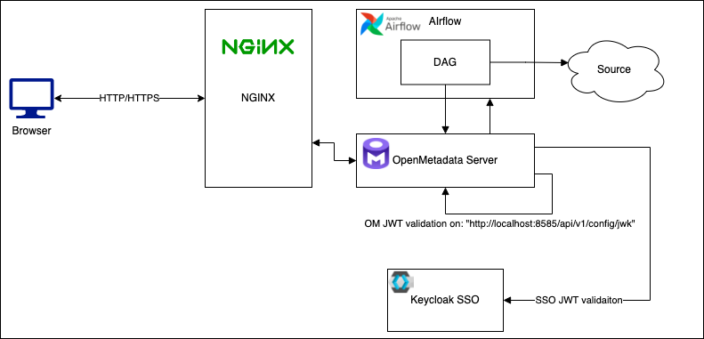
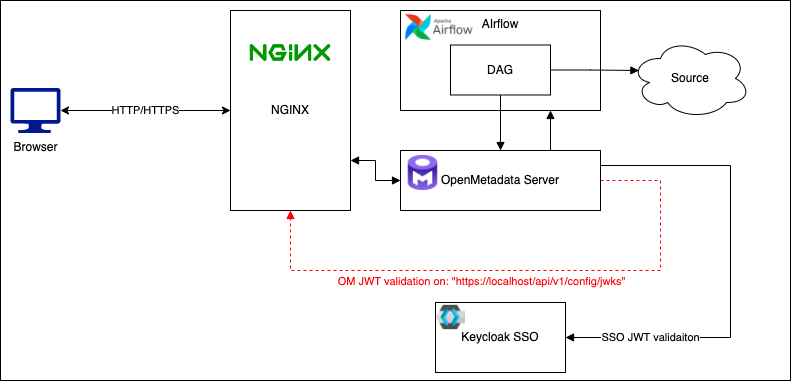
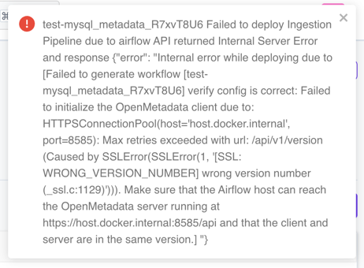
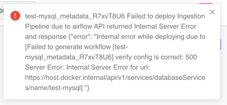

# SSO with SSL configuration Demo

In this demo we want to showcase how to run OpenMetadata in the port 443 with a self-signed certificate with an SSO 
configured. The ingestion of metadata will use the JWT Token configuration for the `ingestion-bot` and the SSO 
configuration for the rest of the users.

The configuration of OM will look like the following one:



The 3 main components in the diagram are:
- `NGINX` acting as a reverse proxy for ports 80 and 443.
- `OM deployment` our OM server with Airflow.
- `Keycloak` as the SSO (but it could be any one of the available).

## Initialize demo

This demo is based on the Keycloak SSO [example](https://github.com/open-metadata/openmetadata-demo/tree/main/keycloak-sso).

In this directory you will find a Docker Compose file that will spin up Keycloak, NGINX and OpenMetadata server.

```shell
docker compose --env-file .env-sso-ssl up
```

## How to generate a SSL certificate

The regeneration of the self-signed certificate can be done by running the following command in the `ssl` folder. The `om-site.conf`
file can be edited to update the values of the certificate.

```shell
openssl req -x509 -nodes -days 365 -newkey rsa:2048 -keyout om-site.key -out om-site.crt -config om-site.conf -passin pass:MyPassword  
```

If we want to avoid any browse security warning about our self-signed certificate (`om-site.crt`) we can add to our OS:
- [Windows](https://learn.microsoft.com/en-us/skype-sdk/sdn/articles/installing-the-trusted-root-certificate)
- [Linux (Ubuntu)](https://ubuntu.com/server/docs/security-trust-store)
- [MacOS](https://support.apple.com/guide/keychain-access/add-certificates-to-a-keychain-kyca2431/mac)

### How to configure the reverse proxy

When NGINX proxies a request, it sends the request to a specified proxied server, fetches the response, and sends it 
back to the client. In our case we want to redirect requests to port `80` to `443` and redirect calls to `443` to the OM
server which will be behind the proxy. The SSL configuration will be handled in NGINX. 

The configuration used in NGINX can be found in `/nginx` folder. And looks like the following one:

```text
worker_processes 1;

events { worker_connections 1024; }

http {
    server {
        listen 80;
        server_name openmetadata_server;

        location / {
            return 301 https://$host$request_uri; # redirect to 443
        }
    }

    server {
        listen 443 ssl;
        server_name openmetadata_server;

        ssl_certificate /etc/ssl/certs/om-site.crt; # SSL configuration
        ssl_certificate_key /etc/ssl/private/om-site.key; # SSL configuration

        location / {
            proxy_pass         http://openmetadata_server:8585; # redirect to OM server in port 8585 
            proxy_redirect     off;
        }
    }
}
```

### How to configure the OpenMetadata server with the SSO and JWT Token

Most of the configuration of OM server can be found in the `.env-sso-ssl` file, but the most important one to be aware of is
the `AUTHENTICATION_PUBLIC_KEYS`. In the `AUTHENTICATION_PUBLIC_KEYS` we need to set two different URLs, one will be the 
one used to validate JWT tokens coming from the SSO, and the other one, will be the one to validate the JWT tokens 
generated by OM server (used by the ingestion-bot).

```properties
AUTHENTICATION_PUBLIC_KEYS=[http://host.docker.internal:8081/realms/data-sec/protocol/openid-connect/certs, http://localhost:8585/api/v1/config/jwks]
```

### Troubleshooting

One common mistake is to configure the OM server in this kind of deployment with the URL of the secured OM server like:
`https://localhost/api/v1/config/jwks` as it is shown in the following diagram:



This will cause this kind of errors when deploying any workflow to Airflow:




The root cause of this error comes from an SSL Handshake error between OM server, or OM Airflow, and the proxy due to be using a self-signed
certificate. The JVM where our OM server is running can not validate the certificate, and it fails. The same happens with
the calls done from Airflow DAGs to the secured OM server URL.

To solve this issue, we have to import public cert of our generated into the Java Keystore of our OM server. In the same
way, we have to configure Airflow to use the public certificate to call the OM Server. To achieve that, first, we need to
update our configuration with:

```properties
# Airflow Configuration
# We will point localhost URLs to the NGINX server port 443
AUTHENTICATION_PUBLIC_KEYS=[http://host.docker.internal:8081/realms/data-sec/protocol/openid-connect/certs, https://host.docker.internal/api/v1/config/jwks]
SERVER_HOST_API_URL=https://host.docker.internal/api

# Airflow SSL Configuration
AIRFLOW_VERIFY_SSL=validate # force SSL validation
AIRFLOW_SSL_CERT_PATH=/tmp/om-site.crt # the public cert used for the validations
```

Secondly, we have to stop and remove `openmetadata_server` and `openmetadata_ingestion` instances:

```shell
docker rm -f openmetadata_server 
docker rm -f openmetadata_ingestion
docker compose --env-file .env-sso-ssl up -d # start them again
```

Finally, we are going to run the following commands:

```shell
 docker cp ssl/om-site.crt openmetadata_server:/tmp/om-site.crt # copy public cert into openmetadata server container
 docker cp ssl/om-site.crt openmetadata_ingestion:/tmp/om-site.crt # copy public cert into openmetadata ingestion container
 docker exec -it openmetadata_server bash # login into OM server instance
 export JAVA_HOME="$(jrunscript -e 'java.lang.System.out.println(java.lang.System.getProperty("java.home"));')" # this will export JAVA_HOME env if it is not set
 cd $JAVA_HOME/lib/security 
 keytool -import -trustcacerts -keystore cacerts -storepass changeit -noprompt -alias localhost -file /tmp/om-site.crt # import public certificate into the JVM keystore
 exit # exit from OM server instance
 docker restart openmetadata_server # restart OM server instance
```

If everything goes as expected, we will be able to redeploy and run our workflow without any error.

## Note

The docker-compose file used in this demo is fixed to the `0.13.2` version, but you can achieve the same result to any version by getting the specific
docker-compose file in this [link](https://github.com/open-metadata/OpenMetadata/blob/main/docker/metadata/docker-compose.yml) (there are different branches 
with the specific version). 

Once you downloaded the docker-compose file, you have to add the `keycloak` and `reverseproxy` service to the docker-compose file.

```yaml
  keycloak:
    image: quay.io/keycloak/keycloak:19.0.1
    command:
      - start-dev
      - --import-realm
    environment:
      KEYCLOAK_IMPORT: /tmp/realm-export.json -Dkeycloak.profile.feature.upload_scripts=enabled
      KEYCLOAK_ADMIN: admin
      KEYCLOAK_ADMIN_PASSWORD: admin
    ports:
      - "8081:8080"
    volumes:
      - ./config/data-sec.json:/opt/keycloak/data/import/data-sec.json
```

